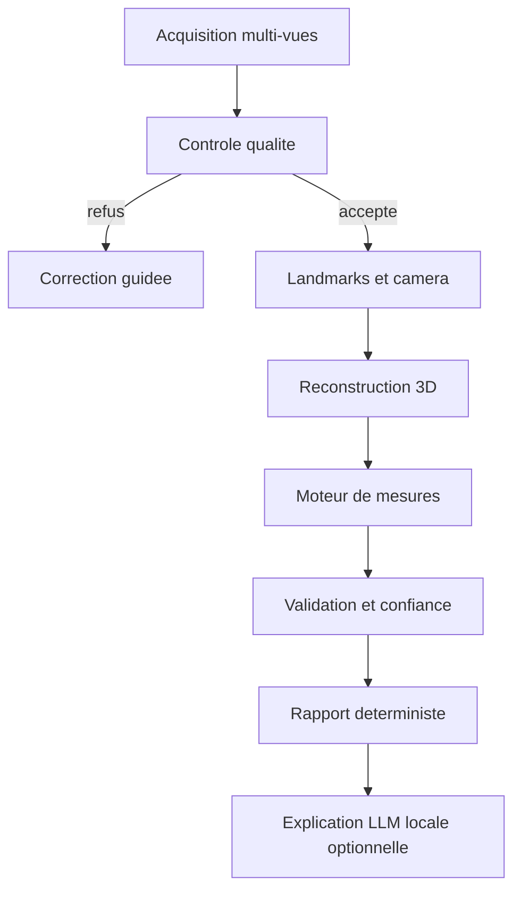

# Architecture cible

## Frontieres

### Interface desktop

Responsable de l'acquisition, du guidage, de la visualisation et de la gestion locale des analyses. Elle ne contient aucune formule morphometrique.

### Moteur d'analyse

Pipeline Python local. Le domaine geometrique reste sans dependance ML. Detection, reconstruction et inference passent par des interfaces afin de comparer ou remplacer les modeles.

### Contrats

Les echanges sont serialises en JSON et portent une version de schema. Une analyse conserve egalement versions du pipeline, des methodes, des modeles et de la calibration.

### Stockage

SQLite chiffre pour les metadonnees ; fichiers chiffres pour images, mesh et exports. Le mode ephemere sans conservation doit rester possible.

### Environnement Docker

Docker Compose est l'environnement de developpement de reference sur Windows. Le service `web` expose Vite uniquement sur `127.0.0.1:1420` et le service `api` expose FastAPI uniquement sur `127.0.0.1:8765`. Les sources sont montees pour le rechargement a chaud. Les futurs runtimes CUDA seront places dans une image separee afin de conserver un chemin CPU leger et testable.

## Pipeline de confiance

Chaque etape peut abaisser la confiance ou rendre une mesure indisponible. Le systeme ne doit pas convertir une absence d'information en valeur par defaut. La confiance finale d'une mesure provient au minimum des landmarks, de la pose, de la calibration et de l'erreur de reconstruction.
